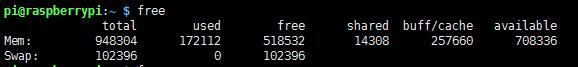

# free  

### `free`命令基本介绍：用于显示内存和交换空间的使用情况。  

-   

- Mem：内存的使用情况  

- Swap：交换空间的使用情况

- total：总共物理内存大小  

- user：已使用的物理内存大小  

- free：可用物理内存大小  

- shared：多个进程共享的物理内存大小  

- buff/cache：磁盘缓存大小  

- available：还可以被应用程序使用的物理内存大小

### `free`参数

- `free`显示的结果默认单位为KB  
- `free -h`用于将结果带上单位  
- `free -b/-k/-m/-g`结果用字节、千字节、兆字节和G字节表示  
- `free -t` 增加一行总计Mem和Swap  
- `free -s N`每隔N秒打印一次信息
- `free`参数可以组合，例如`free -hs 3`