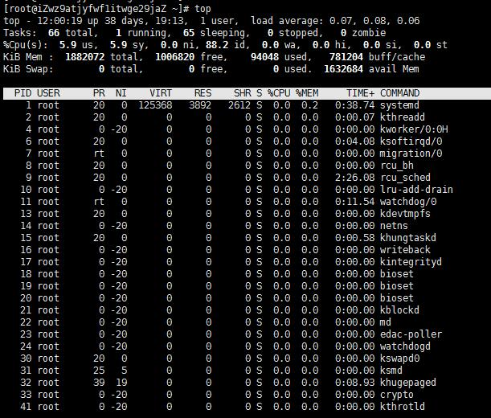

# top  

### `top`命令基本介绍：实时显示进程的状态信息。  

-   
- PID：进程号
- %CPU：cpu利用率
- %MEM：内存使用率

### `top`参数  

- `top -d N`改变显示的更新速度为N秒  
- `top -q`没有任何延迟显示，top会以最高的优先执行  
- `top -i`不显示任何idle进程和zombie进程  
- `top -c`显示完整命令路径  
- `top -p PID`显示进程号为PID的进程  